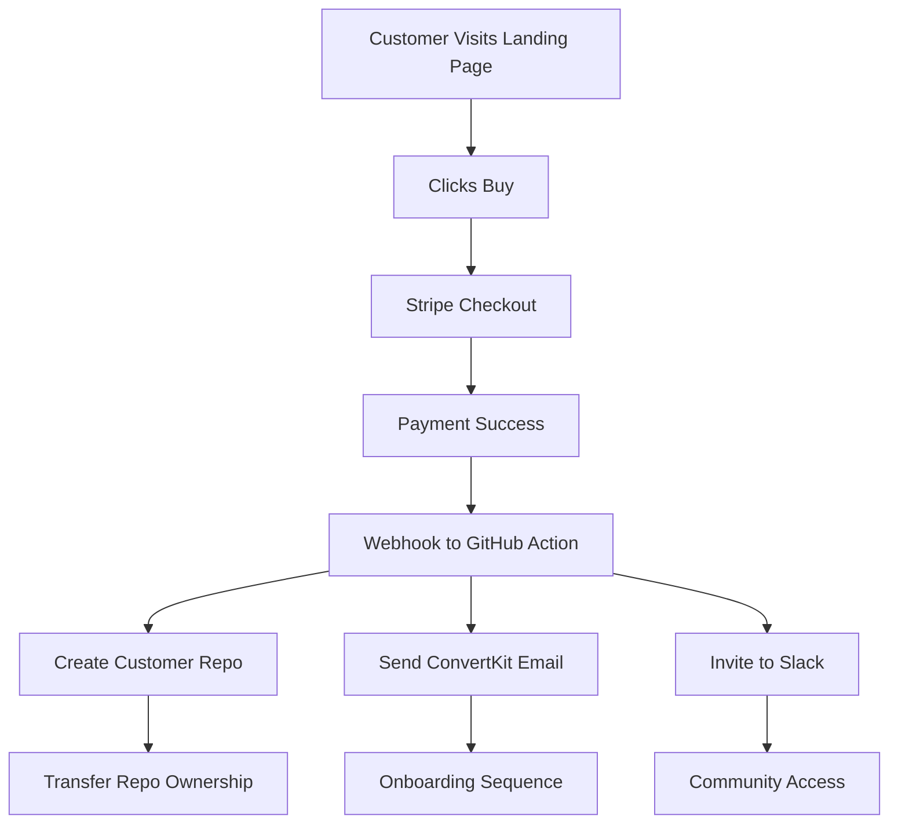

# GitHub-First Technical Architecture

## Core Philosophy: GitHub Is Everything

### What This Means
- **Product delivery:** GitHub repos
- **Customer management:** GitHub issues
- **Documentation:** GitHub wikis/markdown
- **Automation:** GitHub Actions
- **Version control:** Obviously Git
- **Community:** GitHub Discussions

### What This Doesn't Mean
- Everything literally in GitHub (use right tools)
- Forcing GitHub where it doesn't fit
- Ignoring customer experience for purity

---

## Current Tech Stack ($67/month)

### Essential Tools

**GitHub Organization (Free)**
- Product repos (private until purchase)
- Customer repos (transferred post-purchase)
- Documentation (public)
- Community discussions
- Issue tracking

**Stripe ($0 + 2.9% + 30¢)**
- Payment processing
- Subscription management
- Customer portal
- Revenue analytics
- Webhook automation

**ConvertKit ($29/month)**
- Email sequences
- Lead capture
- Broadcast updates
- Segmentation
- Analytics

**Vercel (Free tier)**
- Landing page hosting
- Instant deploys from GitHub
- Analytics
- Edge functions
- A/B testing

**Google Workspace ($12/month)**
- Professional email
- Drive for materials
- Calendar scheduling
- Meet for calls

**Slack (Free → $26/month)**
- Customer community
- Support channel
- Team communication
- Bot automation

### Nice-to-Have Tools

**Fathom Analytics ($14/month)**
- Privacy-first analytics
- No cookie banners
- Simple insights

**Crisp ($25/month)**
- Live chat widget
- Knowledge base
- Email integration

**Make.com ($9/month)**
- Visual automation
- Complex workflows
- API connections

---

## Purchase to Delivery Flow



### Technical Implementation

**1. Stripe Webhook → GitHub Action**
```yaml
name: New Customer Onboarding
on:
  repository_dispatch:
    types: [stripe_payment_success]

jobs:
  onboard:
    runs-on: ubuntu-latest
    steps:
      - name: Create Customer Repo
        run: |
          gh repo create ${{ github.event.client_payload.customer_email }}-biz-os \
            --private \
            --template BuildThingsThatBuildThings/biz-os-template
      
      - name: Personalize Repository
        run: |
          # Update YAML with customer data
          # Commit changes
          # Transfer ownership
```

**2. ConvertKit Integration**
- Tag customer on purchase
- Trigger onboarding sequence
- Weekly tips and updates
- Community highlights

**3. Slack Auto-Invite**
- Webhook from Stripe
- Auto-generate invite
- Add to #welcome channel
- Assign onboarding buddy

---

## Security & Compliance

### Customer Data Protection
- **Stripe:** Handles all payment data (PCI compliant)
- **GitHub:** Private repos until transferred
- **ConvertKit:** Email data encrypted
- **Passwords:** Never stored, OAuth only

### Access Control
- **2FA required** on all accounts
- **API keys** in GitHub Secrets
- **Webhook signatures** verified
- **Customer repos** transferred immediately

### Backup Strategy
- **Code:** Git = distributed backup
- **Customer data:** Stripe = source of truth
- **Content:** GitHub + local clones
- **Email lists:** ConvertKit export weekly

---

## Automation Library

### GitHub Actions We Use

**1. Customer Onboarding**
- Triggered by Stripe webhook
- Creates personalized repo
- Sends welcome emails
- Adds to community

**2. Content Publishing**
- Markdown → Blog post
- Auto-post to social
- Update email sequence
- Track engagement

**3. Support Ticket Router**
- Issue created → Slack notification
- Auto-tag by keywords
- Assign to team member
- Track response time

**4. Weekly Reports**
- Compile metrics
- Generate markdown report
- Email to founder
- Post in team channel

### Zapier/Make Connections

**Stripe → ConvertKit**
- New customer → Add tag
- Failed payment → Email sequence
- Cancellation → Feedback request

**Slack → GitHub**
- Star message → Create issue
- Thread resolved → Close issue
- Feature request → Add to backlog

**ConvertKit → Slack**
- New subscriber → Welcome committee
- High engagement → Sales notify
- Unsubscribe → Investigate why

---

## Scaling Architecture

### 0-100 Customers
- Current stack handles perfectly
- Manual touches still valuable
- Focus on product quality

### 100-1,000 Customers  
- Add Crisp for live chat
- Upgrade Slack to paid
- Consider dedicated support tool
- Add monitoring (Sentry)

### 1,000+ Customers
- Custom dashboard needed
- API for partners
- Enterprise GitHub plan
- Dedicated infrastructure

---

## Disaster Recovery

### If GitHub Goes Down
- Local repos = full backup
- Customer impact minimal (they have repos)
- Support moves to email
- Updates via ConvertKit

### If Stripe Goes Down
- No new sales (rare)
- Existing customers unaffected
- Manual invoicing backup
- Crypto payment option?

### If Everything Burns
- Customer repos are distributed
- Email list in ConvertKit
- Rebuild from documentation
- Community rallies

---

## Development Workflow

### Feature Development
```bash
# 1. Create feature branch
git checkout -b feature/new-automation

# 2. Build and test locally
./scripts/test-local.sh

# 3. Push and create PR
git push origin feature/new-automation

# 4. GitHub Action runs tests
# 5. Merge to main
# 6. Auto-deploy to all systems
```

### Documentation Standards
- Everything in markdown
- Screenshots for complex steps
- Video for critical paths
- Update with every change

---

## Monthly Tech Audit

### Review Checklist
- [ ] Tool costs vs value
- [ ] Automation opportunities
- [ ] Security updates needed
- [ ] Performance bottlenecks
- [ ] Customer friction points
- [ ] Integration improvements
- [ ] Documentation gaps
- [ ] Backup verification

---

*This architecture is designed to handle our first 1,000 customers with minimal complexity. Every tool must earn its place through automation and integration.*